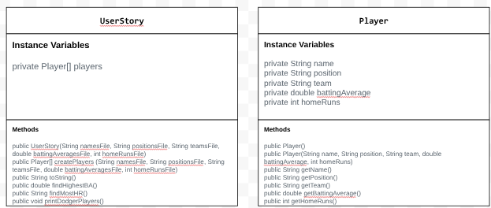

# Unit 3 - Data for Social Good Project

## Introduction

Software engineers develop programs to work with data and provide information to a user. Each user has different needs based on the information they are looking for from data. Your goal is to create a data analysis program for your user that stores and analyzes data to provide the information they need.

## Requirements

Use your knowledge of object-oriented programming, one-dimensional (1D) arrays, and algorithms to create your data analysis program:
- **Write a class** – Write a class to represent your user or business and store and analyze their data with no-argument and parameterized constructors.
- **Create at least two 1D arrays** – Create at least two 1D arrays to store the data that your user needs information about.
- **Write a method** – Write a method that finds or manipulates the elements in a 1D array to provide the information your user needs.
- **Implement a toString() method** – Write a toString() method that returns general information about the data (for example, number of values in the dataset).
- **Document your code** – Use comments to explain the purpose of the methods and code segments and note any preconditions and postconditions.

## User Story 

As a baseball enthusiast I want to find who the best MLB player is.

Who hit the most home runs in the mlb in 2025?
Who had the best batting average in the mlb in 2025?
Who were some of the players on the dodgers in 2025?

## Dataset 

Dataset: https://docs.google.com/spreadsheets/d/1Vnw5WmHkBmqa2D22sBrKDE1thCPwGYSKKMh57jrbURk/edit?gid=0#gid=0
- **Name** (String) - name of the player 
- **Position** (String) - Position the player plays 
- **Team** (String) - The team of the player 
- **battingAverage** (double) - The players batting average 
- **homeRuns** (int) - The number of home runs the player hits.

## UML Diagram 

Put an image of your UML Diagram here. Upload the image of your UML Diagram to your repository, then use the Markdown syntax to insert your image here. Make sure your image file name is one work, otherwise it might not properly get displayed on this README. 

 

## Description 

Write a description of your project here. In your description, include as many vocab words from our class to explain your User Story, the chosen dataset and how your project addressed that users goals. If your project used the Scanner class for user input, explain how the user will interact with your project.

This project uses mlb data from the official mlb website to find statistics about hitters. The user wanted to know who hit the most home runs in the mlb in 2025 and who had the highest batting average in the mlb in 2025. Our project will show the top 125 hitters and how many home runs they hit and what their batting average was. When you run the app, it displays the top 125 hitters and the team, position, home run count, and battering average they have. It also displays who has the most home runs in the mlb in 2025 and who had the highest batting average in the mlb in 2025. The project makes multiple 1D arrays to list the players, teams, homeruns, and positions.